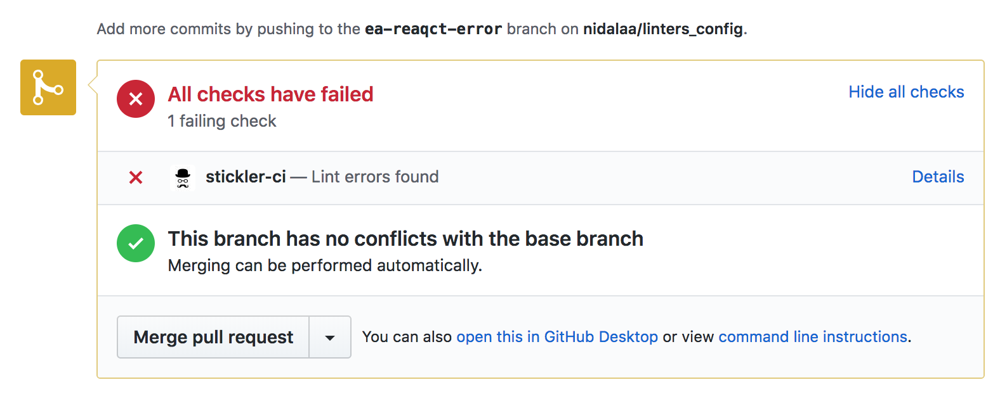
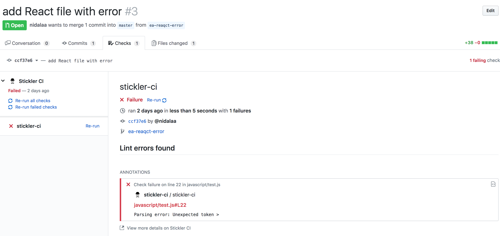
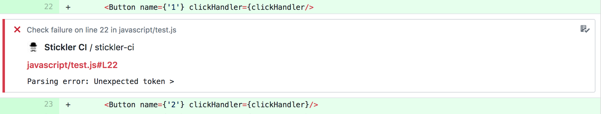

# linters-config

## How to use this repo? 🤔

Each directory contains Stickler's config files specific to one programming language and README file with detailed instructions:

- [css](./css)
- [ruby](./ruby)
- [javascript](./ruby)

Follow those instructions in order to set up Stickler in your repo.

In order to get to know more about linters and Stickler read the recap below.

## Linters

A linter is a tool that analyzes your source code to flag programming errors, bugs, stylistic errors, and suspicious constructs(source: [Wikipedia](https://en.wikipedia.org/wiki/Lint_(software))).

There are a few reasons for using linters:

1. Catching syntax errors is more efficient. There is no need to debug simple mistakes like typos - the linter does it for you.
2. The entire codebase looks like written by one person.
3. Programmers can focus on solving problems, instead of cleaning up the code.

--------------

You can find linters for most of the programming languages, e.g. Rubocop for Ruby or ESLint for JavaScript.

Also, there are many ways you can integrate a linter in your workflow:
- text editor plugin
- git hook
- Github app.

## Stickler

Stickler is an app, that can be integrated into any Github repo. It uses multiple linters that can be configured according to the programmer’s needs.

🐛 **What to do if Stickler does not work?** Check [Troubleshooting](./#troubleshooting) below.

With Stickler enabled you can see:

- Linting result in your PR

- `Checks` tab in your PR

- Comments under any problematic line of code 

See more: https://stickler-ci.com/

## Troubleshooting

If Stickler does not work in your repo, you can always use linters in your local environment.

In that case check detailed instructions for each linter:

- [css](./css#troubleshooting)
- [ruby](./ruby#troubleshooting)
- [javascript](./ruby#troubleshooting)

## Contributing

Everybody is welcome to suggest changes in linters config files.

In order to do it, fork this repository, create a new branch and open a Pull Request from your branch. A detailed description of this process: [A Step by Step Guide to Making Your First GitHub Contribution by Roshan Jossey](https://codeburst.io/a-step-by-step-guide-to-making-your-first-github-contribution-5302260a2940)
