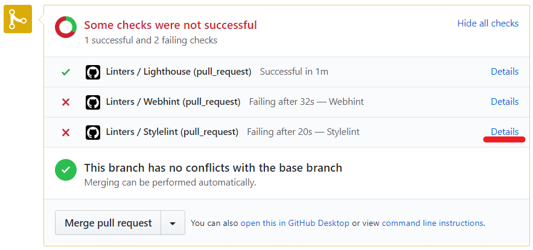
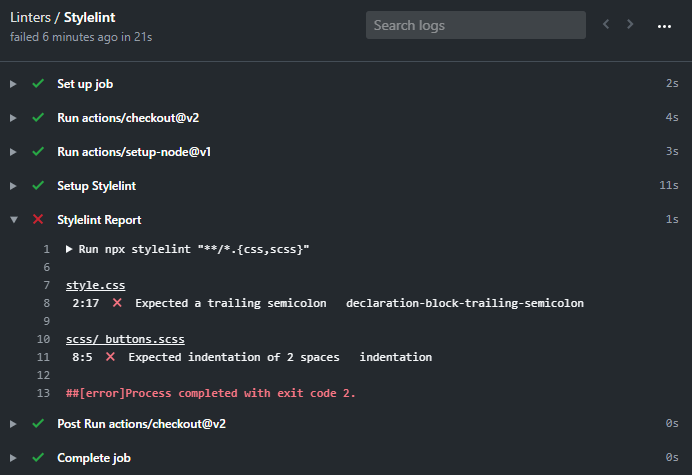
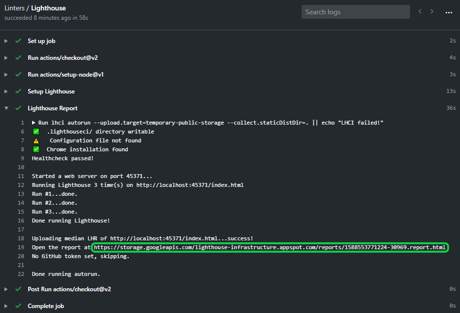

# HTML & CSS3 Course

If you are not familiar with linters, read [root level README](../README.md).

## Set-up GitHub Actions

Please do the following **steps in this order**:

1. In the first commit of your feature branch create a `.github/workflows` folder and add a copy of [`.github/workflows/linters.yml`](.github/workflows/linters.yml) to that folder.
   - **Remember** to use the file linked above
   - **Remember** that `.github` folder starts with a dot.
2. **Do not make any changes in config files - they represent style guidelines that you share with your team - which is a group of all Microverse students.**
   - If you think that change is necessary - open a [Pull Request in this repository](../README.md#contributing) and let your code reviewer know about it.
3. When you open your first pull request you should see the result of the GitHub actions checks:



Click on the `Details` link of each action to see the full output and the errors that need to be fixed:



## Set-up linters in your local env

**Note**: The `npm` package manager is going to create a `node_modules` directory to install all of your dependencies. You shouldn't commit that directory. To avoid that, you can create a [`.gitignore`](https://git-scm.com/docs/gitignore) file and add `node_modules` to it:

```
# .gitignore
node_modules/
```

### [Lighthouse](https://developers.google.com/web/tools/lighthouse)

An open-source, automated tool for improving the quality of web pages. It has audits for performance, accessibility, progressive web apps, SEO and more.

You can get the Lighthouse report by any of the following ways:

- [In Chrome DevTools](https://developers.google.com/web/tools/lighthouse#devtools)
- [From the command line](https://developers.google.com/web/tools/lighthouse#cli)
- [As a Node module](https://developers.google.com/web/tools/lighthouse#programmatic)
- [From a web UI](https://developers.google.com/web/tools/lighthouse#psi)

To access the report generated by Lighthouse on your pull request, click the `Details` link for the `Linters/Lighthouse` check and you will see the full output of the action:



### [Webhint](https://webhint.io/)

A customizable linting tool that helps you improve your site's accessibility, speed, cross-browser compatibility, and more by checking your code for best practices and common errors.

**NOTE:** If you are running on Windows, you need to initialize npm to create `package.json` file. 
   ```
   npm init -y
   ```

1. Run
   ```
   npm install --save-dev hint@6.x
   ```
   *not sure how to use npm? Read [this](https://docs.npmjs.com/downloading-and-installing-node-js-and-npm).*
2. Copy [.hintrc](.hintrc) to the root directory of your project.
3. **Do not make any changes in config files - they represent style guidelines that you share with your team - which is a group of all Microverse students.**
   - If you think that change is necessary - open a [Pull Request in this repository](../README.md#contributing) and let your code reviewer know about it.
4. Run
   ```
   npx hint .
   ```
5. Fix validation errors.

### [Stylelint](https://stylelint.io/)

A mighty, modern linter that helps you avoid errors and enforce conventions in your styles.

1. Run

   ```
   npm install --save-dev stylelint@13.x stylelint-scss@3.x stylelint-config-standard@21.x stylelint-csstree-validator@1.x
   ```

   *not sure how to use npm? Read [this](https://docs.npmjs.com/downloading-and-installing-node-js-and-npm).*

2. Copy [.stylelintrc.json](./.stylelintrc.json) to the root directory of your project.
3. **Do not make any changes in config files - they represent style guidelines that you share with your team - which is a group of all Microverse students.**
   - If you think that change is necessary - open a [Pull Request in this repository](../README.md#contributing) and let your code reviewer know about it.
4. Run `npx stylelint "**/*.{css,scss}"` on the root of your directory of your project.
5. Fix linter errors.
6. **IMPORTANT NOTE**: feel free to research [auto-correct options for Stylelint](https://stylelint.io/user-guide/cli#autofixing-errors) if you get a flood of errors but keep in mind that correcting style errors manually will help you to make a habit of writing a clean code!

## Have you already completed the Sass lessons?

If you completed the Sass lessons you may prefer to work with SCSS files, if that's the case you need to perform
a few modifications to the linter configuration files.

1. In the file `.github/workflows/linters.yml` [line 48](https://github.com/microverseinc/linters-config/blob/master/html-css/.github/workflows/linters.yml#L48) replace `"**/*.{css,scss}"` with `"**/*.scss"`
2. Use `npx stylelint "**/*.scss"` to lint you SCSS files and not the generated CSS

Once you've done the previous steps you can focus on your SCSS files and not in fixing the generated CSS output
every time.
