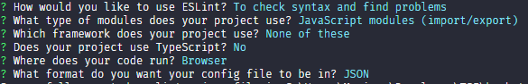

# Javascript

If you are not familiar with linters and Stickler, read [root level README](../README.md).

Please do the following **steps in this order**:

### Set-up Stickler (Github app) - it will show that your app is free from style errors
1. Install stickler-ci https://github.com/apps/stickler-ci
2. Enable stickler in your repo. You can do it [here](https://stickler-ci.com/).
3. In first commit of your feature branch add a copy of [.stickler.yml](./.stickler.yml) and [eslint.config](./eslint.config) to the root directory.
   - **Remember** to use both files linked above
   - **Remember** that `.stickler.yml` file name starts with a dot
4. When you open your first pull request you should see Stickler's report at `Checks` tab.

### Set-up ESlint in your local env - it will help you to find style errors
1. run `npm install eslint eslint-config-airbnb --save-dev` (not sure how to use npm? Read [this](https://docs.npmjs.com/downloading-and-installing-node-js-and-npm))
2. run `npx eslint --init`
3. make sure you select the following options when prompted

4. copy the contents of [.eslintrc.json](./.eslintrc.json) to the newly generated `.eslintrc.json` overwritting the previous content.
5. double check your `./src` folder for any extra unnecesary `.eslint` config files that might have been generated as this might cause an issue with stickler when you create your Pull Request later on
6. run `npx eslint .`
7. fix linter errors
8. **IMPORTANT NOTE**: feel free to research [auto-correct options for ESlint](https://eslint.org/docs/user-guide/command-line-interface#fixing-problems) if you get a flood of errors but keep in mind that correcting style errors manually will help you to make a habit of writing a clean code!

## Troubleshooting

1. All config files are in my repo bu Stickler does not work.

   - Make sure that Stickler app has permission to access your repository. Find Stickler here https://github.com/settings/installations and check its configuration.

   

   - Try to add a new commit to your Pull Request. Stickler should detect changes in your repo and start checking your code.

2. `while scanning for the next token found character '\t' that cannot start any token` error.
   - Please make sure that you used spaces not tabs for indentation.
3. Check if someone else has had similar problem before [here](https://questions.microverse.org/c/linters-stickler).
   Please make sure that you used spaces not tabs for indentation.
4. Stickler does not work and nothing helps 💥 - run [eslint](https://eslint.org/) in your local env and correct all errors. **Remember to let your Code Reviewer know that you had problems with Stickler and you used linter in local env.**
